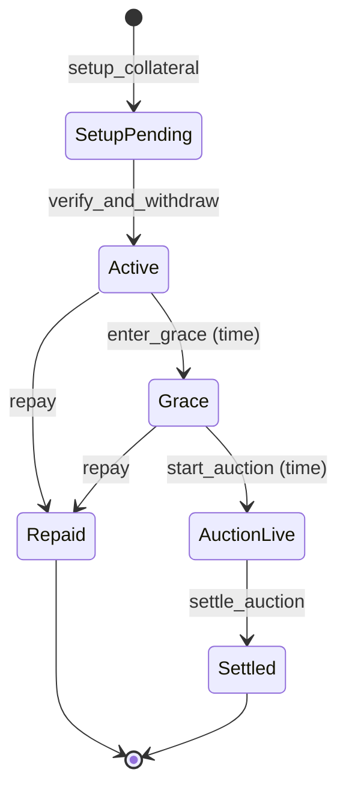

# Solease 技术方案文档（MVP 版）

## 1. 技术栈

* Program：Anchor (Rust)
* Token：SPL Token（USDC）
* 时间：Clock sysvar `unix_timestamp`
* 前端：Next.js + wallet adapter
* 查询：

  * MVP 不自建 indexer，前端直接 RPC 读 Program accounts + SNS SDK 辅助

---

## 2. 核心状态机

---

## 3. PDA 与账户模型（建议字段）

### 3.1 GlobalState

* seeds：`["global"]`
* fields：

  * admin_pubkey
  * supported_mint (USDC)
  * config：grace_period_secs, min_increment_bps, buy_now_params
  * risk：global_cap, tier_caps（MVP 可硬编码成表或简单配置）

### 3.2 PoolState

* seeds：`["pool", mint]`
* fields：

  * mint
  * vault_ata（owned by PoolVault PDA）
  * total_shares
  * total_principal_outstanding
  * total_interest_collected
  * buffer_bps（例如 2000 = 20%）

### 3.3 LPPosition

* seeds：`["lp", pool, owner]`
* fields：

  * owner
  * shares

### 3.4 OfferAccount（P2P）

* seeds：`["offer", lender, nonce]`
* fields：

  * lender
  * principal
  * apr_bps
  * duration_secs
  * expiry_ts
  * domain_constraint（optional：specific domain key / none）
  * status: Open | Taken | Cancelled
* OfferEscrow ATA：PDA 持有 USDC

### 3.5 LoanAccount

* seeds：`["loan", domain_registry_pubkey]`（确保同域名唯一贷款）
* fields：

  * borrower
  * mode: Pool | P2P
  * principal
  * apr_bps
  * start_ts
  * due_ts
  * grace_start_ts
  * status: SetupPending | Active | Grace | AuctionLive | Repaid | Settled
  * payout_pubkey（用于 record 策略）
  * escrow_pda（域名 owner PDA）
  * source（PoolState pubkey / OfferAccount pubkey）

### 3.6 AuctionAccount

* seeds：`["auction", loan]`
* fields：

  * loan
  * start_ts
  * end_ts
  * min_bid
  * highest_bid
  * highest_bidder
  * buy_now_start_price
  * buy_now_end_price
  * buy_now_end_ts
  * status: Live | Ended | Settled
* BidEscrow：保存最高出价（USDC）

---

## 4. 指令设计（输入/校验/输出）

### 4.1 init_global(admin, mint, params)

* only once
* 写入配置

### 4.2 init_pool(mint, buffer_bps)

* 创建 PoolState、PoolVault PDA、vault ATA

### 4.3 deposit_liquidity(pool, owner, amount)

* 校验 mint、转账 owner → vault
* shares mint 逻辑：

  * 若 total_shares=0：shares=amount
  * 否则：shares = amount * total_shares / total_assets（MVP total_assets≈vault_balance+outstanding_principal）

### 4.4 withdraw_liquidity(pool, owner, shares)

* amount = shares * total_assets / total_shares
* 校验 vault_balance >= amount（MVP 不排队）
* 转账 vault → owner

### 4.5 create_offer(lender, principal, apr_bps, duration, expiry, constraint)

* 转账 lender → OfferEscrow
* offer.status = Open

### 4.6 cancel_offer(lender, offer)

* require offer.status=Open
* 退回 OfferEscrow → lender
* offer.status = Cancelled

### 4.7 setup_collateral(borrower, domain_registry, mode, source_id, payout_pubkey)

**校验重点：**

* registry.owner == borrower（通过读取 SNS registry account）
* not tokenized（MVP：若检测到 tokenized 标志/相关账户存在则拒绝）
* registrar check（MVP：若 registrar account 存在则拒绝）
* LoanAccount 不存在或状态终止
  **动作：**
* 创建 LoanAccount（SetupPending）
* 将 registry.owner 转给 Escrow PDA（CPI 或系统转 owner 逻辑，按 SNS 接口）
* 写入 due_ts（now + duration）
* 记录 payout_pubkey（用于结算时清理/重写 record 的依据）

### 4.8 verify_and_withdraw(borrower, loan, mode, source)

* require loan.status=SetupPending
* require registry.owner == loan.escrow_pda
* Pool：

  * require vault_balance - principal >= buffer
  * vault → borrower 转账 principal
  * pool.outstanding += principal
* P2P：

  * require offer.status=Open && now<expiry
  * OfferEscrow → borrower principal
  * offer.status=Taken
* loan.start_ts=now, status=Active

### 4.9 repay(borrower, loan)

* require status in {Active, Grace}
* owed = principal + interest + (if Grace) penalty

  * interest = principal * apr_bps * elapsed / year
  * penalty = principal * penalty_bps * grace_elapsed / year（或固定罚金）
* borrower → destination（PoolVault 或 Lender）
* registry.owner：Escrow PDA → borrower
* loan.status=Repaid
* Pool：outstanding -= principal, interest_collected += interest+penalty

### 4.10 enter_grace(loan)

* require status=Active && now>=due_ts
* set status=Grace, grace_start_ts=now

### 4.11 start_auction(loan)

* require status=Grace && now>=due_ts + grace_period
* create AuctionAccount（Live）
* loan.status=AuctionLive

### 4.12 place_bid(bidder, auction, amount)

* require auction.status=Live && now<end_ts
* require amount >= max(min_bid, highest_bid + min_increment)
* bidder → BidEscrow（若已有最高出价先退回）
* update highest_bidder/highest_bid

### 4.13 buy_it_now(bidder, auction)

* require auction.status=Live
* price = linear(buy_now_start, buy_now_end, now)
* bidder → BidEscrow price（退回旧最高出价）
* set highest_bidder=bidder, highest_bid=price
* set auction.status=Ended（可立刻 settle）

### 4.14 settle_auction(auction, loan, winner)

* require auction.status in {Ended, Live && now>=end_ts}
* require loan.status=AuctionLive
* **资金分配**：

  * Pool：BidEscrow → PoolVault（至多 owed），剩余可返 borrower（MVP 可不返）
  * P2P：BidEscrow → lender（至多 owed），剩余可返 borrower
* **域名转移**：Escrow PDA → winner
* **Record 清理/重写**（MVP 最低）：

  * 调用 SNS record 删除/重写指令（V1 delete）
  * 若无法在同 tx 内完成，则设置 `loan.record_needs_cleanup=true` 并要求 UI 触发 `cleanup_record(winner)`（需要 winner 签名）
* loan.status=Settled，auction.status=Settled

### 4.15 cleanup_record(domain, signer)

* require signer == current owner（winner）
* 执行 record delete 或重写为 signer 指定地址
* 标记 cleanup 完成

---

## 5. 安全与边界条件（MVP 必须写进代码）

* 域名唯一贷款：Loan PDA seed = domain_registry，防双重抵押
* 所有状态迁移只允许单向（防“回滚拿钱”）
* Token transfer 校验 mint、authority、ATA
* 拍卖退回最高出价时要严格处理失败回滚（原子性）
* 禁止 repay after auction start（MVP 简化）；若允许则必须处理 bid 退款逻辑（容易炸，不建议）

---

## 6. 事件（Events）定义（方便前端不写 indexer 也能查）

* LoanSetupPending(domain, borrower, mode, principal, due_ts)
* LoanActivated(loan, borrower, principal)
* LoanRepaid(loan, total_paid)
* LoanGraceEntered(loan)
* AuctionStarted(loan, auction, end_ts)
* BidPlaced(auction, bidder, amount)
* BuyItNow(auction, bidder, price)
* AuctionSettled(auction, winner, paid_to_creditor)

---

## 7. 前端与链交互（MVP 操作脚本级别）

* Borrower 借款（Pool/P2P）：

  1. 调 `setup_collateral`（Tx1）
  2. 显示“身份抵押中（Showcase）”
  3. 调 `verify_and_withdraw`（Tx2）
* 还款：

  * 调 `repay`（Tx1）
* 违约清算：

  * keeper 或手动按钮 `enter_grace` / `start_auction`
  * bidders `place_bid` / `buy_it_now`
  * `settle_auction`
  * 若需要：`cleanup_record`

---
尤其是：

* **Record 残留**：写进 `settle_auction/cleanup_record`
* **Reverse 丢失**：写进产品交互与 Showcase 面板
* **Registrar 风险**：写进抵押准入硬校验
* **Wash trading**：Pool cap 设计直接规避
* **流拍死锁**：Buy-it-now 线性下降兜底
